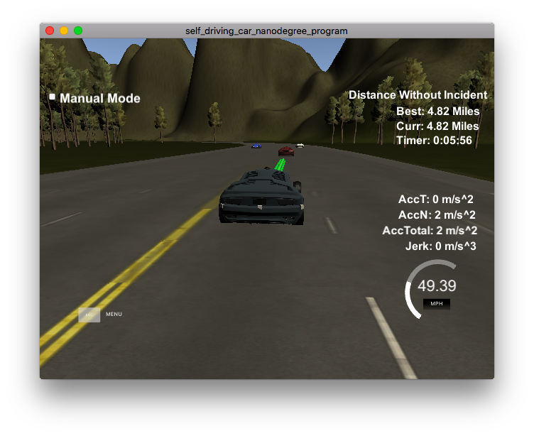

# CarND-Path-Planning-Project
Self-Driving Car Engineer Nanodegree Program

### Simulator.
You can download the Term3 Simulator which contains the Path Planning Project from the [releases tab (https://github.com/udacity/self-driving-car-sim/releases/tag/T3_v1.2).  

To run the simulator on Mac/Linux, first make the binary file executable with the following command:
```shell
sudo chmod u+x {simulator_file_name}
```

### Goals
In this project your goal is to safely navigate around a virtual highway with other traffic that is driving +-10 MPH of the 50 MPH speed limit. You will be provided the car's localization and sensor fusion data, there is also a sparse map list of waypoints around the highway. The car should try to go as close as possible to the 50 MPH speed limit, which means passing slower traffic when possible, note that other cars will try to change lanes too. The car should avoid hitting other cars at all cost as well as driving inside of the marked road lanes at all times, unless going from one lane to another. The car should be able to make one complete loop around the 6946m highway. Since the car is trying to go 50 MPH, it should take a little over 5 minutes to complete 1 loop. Also the car should not experience total acceleration over 10 m/s^2 and jerk that is greater than 10 m/s^3.

## Basic Build Instructions

1. Clone this repo.
2. Make a build directory: `mkdir build && cd build`
3. Compile: `cmake .. && make`
4. Run it: `./path_planning`.

Here is the data provided from the Simulator to the C++ Program

---

## Dependencies

* cmake >= 3.5
  * All OSes: [click here for installation instructions](https://cmake.org/install/)
* make >= 4.1
  * Linux: make is installed by default on most Linux distros
  * Mac: [install Xcode command line tools to get make](https://developer.apple.com/xcode/features/)
  * Windows: [Click here for installation instructions](http://gnuwin32.sourceforge.net/packages/make.htm)
* gcc/g++ >= 5.4
  * Linux: gcc / g++ is installed by default on most Linux distros
  * Mac: same deal as make - [install Xcode command line tools]((https://developer.apple.com/xcode/features/)
  * Windows: recommend using [MinGW](http://www.mingw.org/)
* [uWebSockets](https://github.com/uWebSockets/uWebSockets)
  * Run either `install-mac.sh` or `install-ubuntu.sh`.
  * If you install from source, checkout to commit `e94b6e1`, i.e.
    ```
    git clone https://github.com/uWebSockets/uWebSockets
    cd uWebSockets
    git checkout e94b6e1
    ```

## Rubric Points

### Compilation
#### The code compiles correctly.

### Valid Trajectories
#### The car is able to drive at least 4.32 miles without incident.

I able to drive over 4.32 miles without inncident.

#### The car drives according to the speed limit.
I have't seen red message of speed limit.

#### Max Acceleration and Jerk are not Exceeded.
I have't seen red message of jerk.

#### Car does not have collisions.
There are no collisions.

#### The car stays in its lane, except for the time between changing lanes.
The car stays in its lane most of the time, except for the changing lanes.

#### The car is able to change lanes
The car can change lanes when slower car ahead.

## Reflection
This code based on provided code and the Q&A video that is provided by Udacity.
I didn't use finite state machine, because I thought this situation of changing lane is simple.
So, I selected 'IF' statement there are slower car or not.
### Improvement
When a car ahed my car, I slow down my car. And distance between the car is enogh, accelacete my car.
This car following is works good without colligin.But its behavior　is little unnatual.
My car repeating deceleration and acceleration, can't follow the car same speed.
